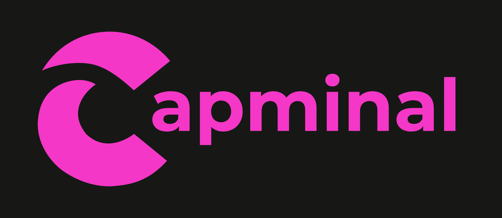
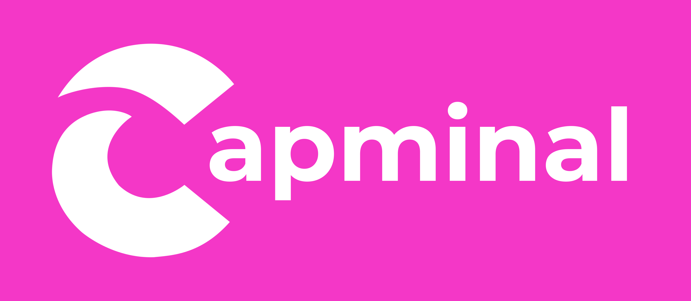
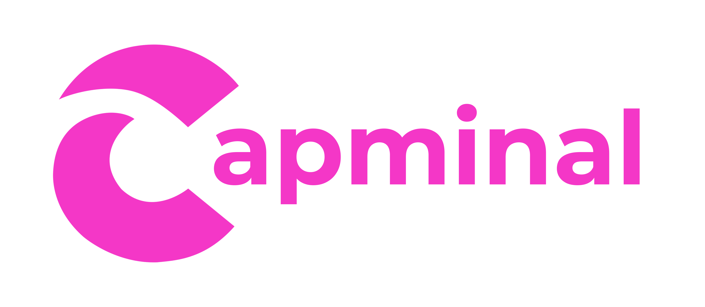

# Brand Assets

The Capminal "Brand Assets" provided below are protected by copyright and should only be used in compliance with the specified policy.

* The Capminal logos, wordmark & emoji.
* "Capminal" name.

## Approved Use Cases

You are permitted to utilize Capminal's Brand Assets in the following scenarios:

* When referencing our products and services.
* When linking to our official website or products, e.g:&#x20;
  * Trade our token on Capminal
  * Deploy our token on Capminal
* When announcing an official partnership, provided you have obtained official approval from a designated member of the Capminal team

Capminal Logo

<figure><figcaption></figcaption></figure> <figure><figcaption></figcaption></figure> <figure><figcaption></figcaption></figure> <figure><figcaption></figcaption></figure> <figure><figcaption></figcaption></figure> <figure><figcaption></figcaption></figure> <figure><figcaption></figcaption></figure> <figure><figcaption></figcaption></figure>

For inquiries regarding other applications of our Brand Assets, kindly [contact-us.md](contact-us.md "mention").

By access this files, you confirm that you will only use it to the extent permitted by the [terms-of-service.md](terms-of-service.md "mention") detailed in this page.
