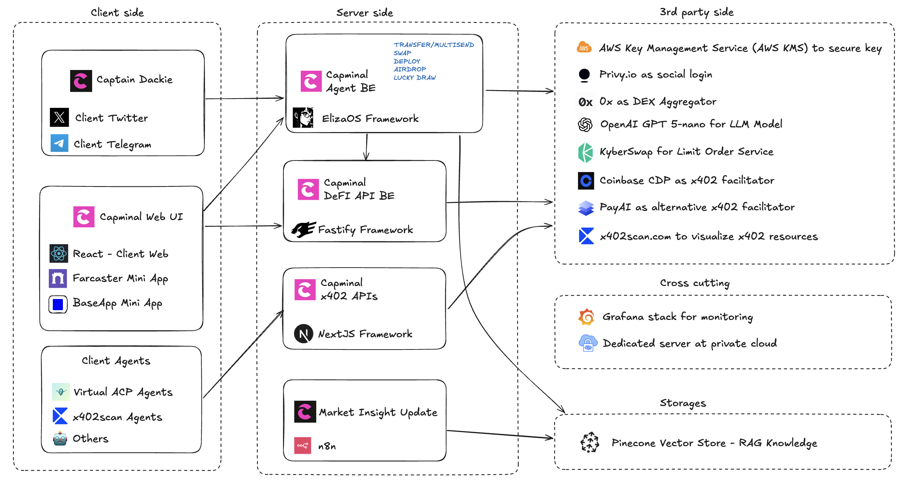

# Tokenomics

## CAP Token

Token Name: **Capminal**

Token Symbol: **CAP**

Max Supply: **1,000,000,000 CAP**

## Tokenomics

We focus on the long-term vision for our CAP token, with these key highlights:

* At TGE, only Public Sale participants will receive tokens
* The first unlock occurring one month after TGE.
* Early backers will receive their allocation after two months, subject to a vesting schedule.
* The Team and DAO Treasury allocations will be distributed after three months and six months, also with vesting.


2% is for [CAP Points](../capminal/product-features/cap-points.md) and Referrals Program. Don't miss out.


<figure><figcaption></figcaption></figure>

## Vesting Schedule

To visualize the vesting schedule, refer this diagram.

<figure><figcaption></figcaption></figure>

## Use cases

When designing the use cases for Capminal (CAP), our focus is on increasing scarcity and reducing the supply of CAP over time. Here are the key use cases:

* CAP will serve as the main payment token within the Capminal ecosystem.
* Use CAP for VIP subscriptions to enjoy reduced trading fees and access to priority features.
* CAP will be used for future service payments (details to be announced).
* Hold CAP to receive airdrops from partner projects.
* CAP will be fully supported by DackieSwap Yield Farming.
* Monthly buyback and burn of CAP using trading fees and Clanker UI fees.
* Use CAP for governance.
