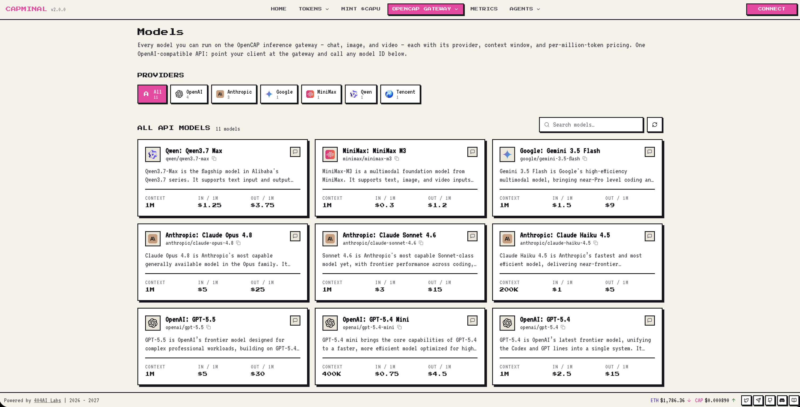
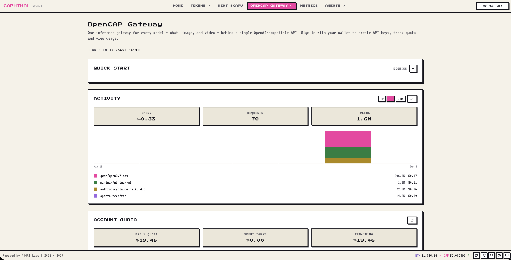
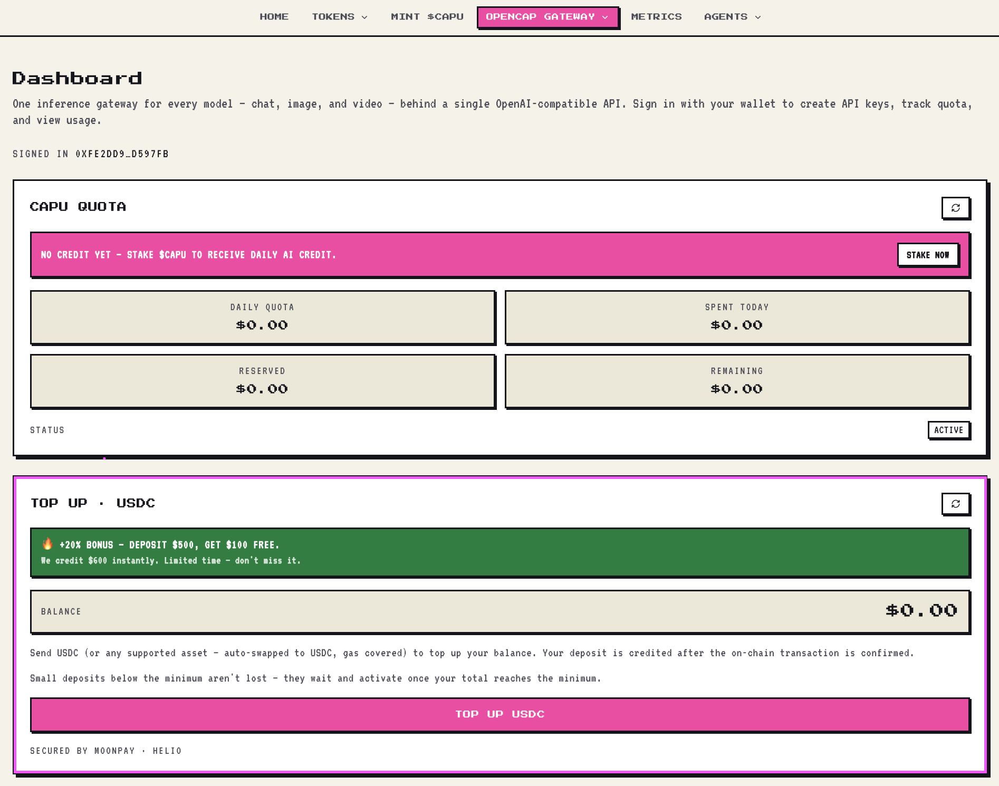
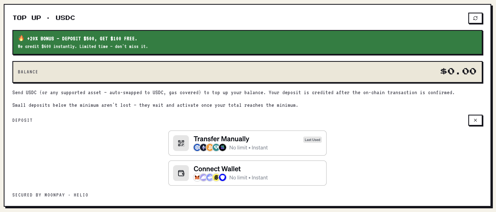
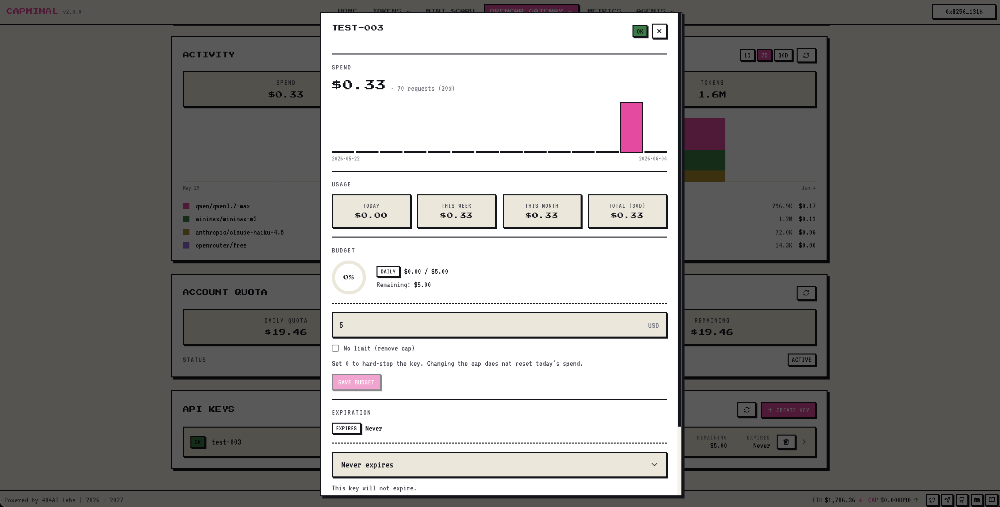

# Gateway

**OpenCAP Gateway** is a unified **LLM gateway** that lets you create an API key and tap into a wide range of AI models through a single, OpenAI-compatible endpoint:

```
https://gw.capminal.ai
```

Instead of juggling separate accounts, billing, and SDKs for every provider, you point your app at one base URL, authenticate with one key, and route requests to whichever model you need.

<figure><figcaption></figcaption></figure>


**No subscription. No credit card.** Your daily inference usage is funded by your **staked CAPU** — not a monthly bill.



**Where does the free Inference Credit come from?** It's funded by **part of our revenue**, and we secure **bulk deals with our model providers** — so we can pass real inference capacity back to stakers at no extra cost.


## How it works

1. **Log in with your wallet.** Connect the wallet that holds your staked CAPU.
2. **Get daily Inference Credit.** Every wallet with **staked CAPU** is granted a daily allowance of Inference Credit — **$1 of inference usage per staked CAPU, every day**, renewed at 00:00 UTC. Don't have CAPU yet? See [Mint CAPU](../product-features/mint-capu.md) to learn how to get and stake it.
3. **Create a key.** Generate an `OPENCAP_API_KEY` from the dashboard.
4. **Start building.** Use the key with any OpenAI-compatible client, terminal, or agent framework — your usage draws down your daily Inference Credit automatically.

<figure><figcaption></figcaption></figure>


Inference Credit is tied to your **staked** CAPU. Stake more CAPU → larger daily allowance. Credit resets every day and does **not** roll over.


### The full flow at a glance


Lock **CAP → sCAP → CAPU** (or simply buy CAPU), stake it to earn daily **Inference Credit**, then create an `OPENCAP_API_KEY` and point any AI app at the gateway — every request draws down your daily Credit.

***

## Two ways to fund your inference

You don't have to choose just one. Both sources fund the same `OPENCAP_API_KEY` — the gateway draws on whatever you have.

| Funding source | What it is | Best for |
| -------------- | ---------- | -------- |
| **Inference Credit from CAPU Staking** | A **daily allowance** — $1/day of inference per staked CAPU, renewed at 00:00 UTC, non-rolling. | Steady, recurring usage you want to cover with capital you already hold. See [Mint CAPU](../product-features/mint-capu.md). |
| **USDC Top-Up** | A **prepaid balance** you load with USDC. It doesn't reset — you spend it down until it runs out. | One-off bursts, spikes above your daily allowance, or anyone who'd rather just pay as they go. |

Your daily staking Credit is used first; once it's exhausted, the gateway falls back to your topped-up USDC balance. Stake for the everyday baseline, top up for the headroom.

### Top-Up Inference with USDC

Want more inference without staking — or just a buffer for heavy days? **Top up your balance directly with USDC**, with payment powered by **MoonPay**.

1. **Open the Top-Up card** on your dashboard and hit **Top-Up USDC**.
2. **Pay with USDC** — or any supported asset, which is **auto-swapped to USDC for you, with gas covered**.
3. **Get credited automatically** once the on-chain transaction confirms. The balance shows up on your dashboard — no manual steps.
4. **Spend it anytime.** Unlike daily Credit, your topped-up balance **does not reset** — it carries over until you use it.

<figure><figcaption><p>The Top-Up · USDC card on your dashboard, alongside your CAPU staking quota.</p></figcaption></figure>

#### Two ways to pay

When you open the deposit panel, you can choose how to send your funds:

* **Transfer Manually (QR)** — scan the QR or copy the address and send from any wallet or exchange. Works with USDC and other supported assets. No limit · instant.
* **Connect Wallet** — connect a wallet (MetaMask, Coinbase, WalletConnect, and more) and pay in a couple of clicks, right from the browser. No limit · instant.

<figure><figcaption><p>Pick a deposit method — Transfer Manually by QR, or Connect Wallet to pay directly.</p></figcaption></figure>


**Powered by MoonPay & Helio.** Checkout runs inside the dashboard through the official MoonPay widget. Your deposit is credited **server-side after the on-chain transaction is confirmed**, so closing the window mid-flow never loses a confirmed payment.



**Small deposits aren't lost.** If you send less than the minimum, the amount is **parked** and activates automatically once your total reaches the minimum — you'll see the progress on the Top-Up card.


***

## Quick Start

After creating your key, here are a few ways to start using OpenCAP Gateway.

**Base URL**

```
https://gw.capminal.ai/api/inference/v1
```

### Use in Terminal

```bash
export OPENCAP_API_KEY="ocap_..."

curl https://gw.capminal.ai/api/inference/v1/chat/completions \
  -H "Authorization: Bearer $OPENCAP_API_KEY" \
  -H "Content-Type: application/json" \
  -d '{
    "model": "claude-opus-4.8",
    "messages": [{"role": "user", "content": "Hello from OpenCAP"}],
    "stream": true
  }'
```

### Use in OpenClaw

```json
// ~/.openclaw/openclaw.json
{
  "models": {
    "providers": {
      "opencap": {
        "baseUrl": "https://gw.capminal.ai/api/inference/v1",
        "api": "openai-completions",
        "key": "${OPENCAP_API_KEY}",
        "models": [
          {
            "id": "claude-opus-4.8",
            "name": "Claude Opus 4.8",
            "contextWindow": 200000,
            "maxTokens": 32000
          }
        ]
      }
    }
  },
  "agents": {
    "defaults": {
      "model": { "primary": "opencap/claude-opus-4.8" }
    }
  }
}
```

### Use in Hermes

```yaml
# ~/.hermes/.env
OPENCAP_API_KEY=ocap_...

# ~/.hermes/config.yaml
model:
  provider: custom:opencap-gw
  default: claude-opus-4.8
  base_url: https://gw.capminal.ai/api/inference/v1
  api_key: ${OPENCAP_API_KEY}
  api_mode: chat_completions
```

### Use in OpenCode

```json
// ~/.config/opencode/opencode.json
{
  "$schema": "https://opencode.ai/config.json",
  "provider": {
    "opencap": {
      "npm": "@ai-sdk/openai-compatible",
      "name": "OpenCAP Gateway",
      "options": {
        "baseURL": "https://gw.capminal.ai/api/inference/v1",
        "apiKey": "{env:OPENCAP_API_KEY}"
      },
      "models": {
        "claude-opus-4.8": {
          "name": "Claude Opus 4.8"
        }
      }
    }
  }
}
```

***


Keep your `OPENCAP_API_KEY` secret. Anyone with your key can spend your daily Inference Credit. You can revoke and regenerate keys at any time from the dashboard.


Open any key to see its live spend, usage, and budget — set a per-key daily cap, change its expiration, or revoke it on the spot.

<figure><figcaption></figcaption></figure>
