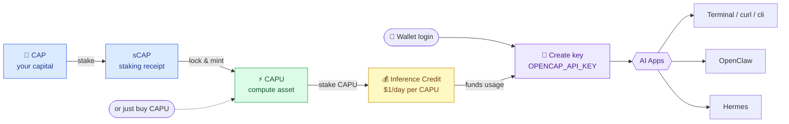

# Gateway

**OpenCAP Gateway** is a unified **LLM gateway** that lets you create an API key and tap into a wide range of AI models through a single, OpenAI-compatible endpoint:

```
https://gw.capminal.ai
```

Instead of juggling separate accounts, billing, and SDKs for every provider, you point your app at one base URL, authenticate with one key, and route requests to whichever model you need.


**No subscription. No credit card.** Your daily inference usage is funded by your **staked CAPU** — not a monthly bill.


## How it works

1. **Log in with your wallet.** Connect the wallet that holds your staked CAPU.
2. **Get daily Inference Credit.** Every wallet with **staked CAPU** is granted a daily allowance of Inference Credit — **$1 of inference usage per staked CAPU, every day**, renewed at 00:00 UTC. Don't have CAPU yet? See [Mint CAPU](../product-features/mint-capu.md) to learn how to get and stake it.
3. **Create a key.** Generate an `OPENCAP_API_KEY` from the dashboard.
4. **Start building.** Use the key with any OpenAI-compatible client, terminal, or agent framework — your usage draws down your daily Inference Credit automatically.


Inference Credit is tied to your **staked** CAPU. Stake more CAPU → larger daily allowance. Credit resets every day and does **not** roll over.


### The full flow at a glance



Lock **CAP → sCAP → CAPU** (or simply buy CAPU), stake it to earn daily **Inference Credit**, then create an `OPENCAP_API_KEY` and point any AI app at the gateway — every request draws down your daily Credit.

***

## Quick Start

After creating your key, here are a few ways to start using OpenCAP Gateway.

**Base URL**

```
https://gw.capminal.ai/api/inference/v1
```

### Use in Terminal

```bash
export OPENCAP_API_KEY="ocap_..."

curl https://gw.capminal.ai/api/inference/v1/chat/completions \
  -H "Authorization: Bearer $OPENCAP_API_KEY" \
  -H "Content-Type: application/json" \
  -d '{
    "model": "claude-opus-4.8",
    "messages": [{"role": "user", "content": "Hello from OpenCAP"}],
    "stream": true
  }'
```

### Use in OpenClaw

```json
// ~/.openclaw/openclaw.json
{
  "models": {
    "providers": {
      "opencap": {
        "baseUrl": "https://gw.capminal.ai/api/inference/v1",
        "api": "openai-completions",
        "key": "${OPENCAP_API_KEY}",
        "models": [
          {
            "id": "claude-opus-4.8",
            "name": "Claude Opus 4.8",
            "contextWindow": 200000,
            "maxTokens": 32000
          }
        ]
      }
    }
  },
  "agents": {
    "defaults": {
      "model": { "primary": "opencap/claude-opus-4.8" }
    }
  }
}
```

### Use in Hermes

```yaml
# ~/.hermes/.env
OPENCAP_API_KEY=ocap_...

# ~/.hermes/config.yaml
model:
  provider: custom:opencap-gw
  default: claude-opus-4.8
  base_url: https://gw.capminal.ai/api/inference/v1
  api_key: ${OPENCAP_API_KEY}
  api_mode: chat_completions
```

***


Keep your `OPENCAP_API_KEY` secret. Anyone with your key can spend your daily Inference Credit. You can revoke and regenerate keys at any time from the dashboard.

