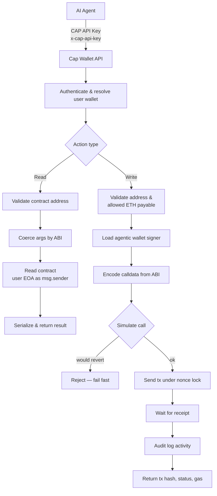

# Agent Skills

**Skills** let Capminal's **agentic wallet (Cap Wallet)** expand and interact **infinitely** with smart contracts and external APIs. Each skill is a modular ability that teaches an agent a new capability — from transferring tokens and swapping assets to reading and writing any on-chain contract.

This is what turns Cap Wallet from a passive key store into a **true agentic wallet**: an autonomous actor that can reason about a goal, pick the right skill, and execute it on-chain or against any API — without a human signing every step.

## Agent-native access via API Key

Agents interact with Cap Wallet through a **Wallet API Key** instead of a private key.


[wallet-api-key.md](../product-features/wallet-api-key.md)


This is the key design decision behind the agentic wallet:

* The private key never leaves Cap Wallet's infrastructure — agents never touch it.
* Agents authenticate with a scoped, rotatable API Key and ask Cap Wallet to execute operations on their behalf.
* Keys can be rotated or revoked at any time, so a compromised agent never means a compromised wallet.

All skill requests include the API Key in the request header:

```http
CAP_API_KEY: YOUR_CAP_API_KEY
```

## Core Skills

There are two core skills shipped with Cap Wallet:

| Skill | What it does |
|-------|--------------|
| **capminal** | Basic skills to interact with Cap Wallet — transfer, swap, deploy, claim rewards, and other native wallet actions. |
| **contract-interaction** | A generic, abstract skill for reading and writing **any** smart contract — supply a flexible ABI, contract address, and params, and execute it via your CAP API Key. |

### Why contract-interaction matters

The **contract-interaction** skill is an **abstract skill** — it is not tied to a single protocol or contract. By accepting any ABI, address, and parameters, it lets Cap Wallet **read and write any contract on-chain**, expanding the wallet's capabilities **infinitely**.

This is what makes Cap Wallet **the real agentic wallet**: it is not limited to a fixed menu of actions. If a contract exists, an agent can call it. New protocols, new primitives, and new use cases become available without shipping a new skill for each one.

## How It Works

When an agent calls a skill, Cap Wallet authenticates the request with the API Key, resolves the owning wallet, and routes it to a **read** or **write** path. Writes run through guardrails (value cap + simulation) before a transaction is ever signed — the private key stays inside Cap Wallet at all times.



Every write is **simulated before it consumes a nonce**, native value is capped per transaction, and the action is recorded to an activity log — so autonomy never comes at the cost of safety.

## Contribute a Skill

Skills are **community-driven**. Anyone can contribute new agent skills:



To add a skill, fork the repository, create a folder for your skill containing a `SKILL.md` (instructions and API documentation for agents) and a `_meta.json` (skill metadata), then open a Pull Request. Keep each skill focused on a single purpose, document its API with clear examples, and always instruct agents to secure their API Keys.

For the full step-by-step fork → branch → PR workflow, see the [**CONTRIBUTE.md**](https://github.com/capminal/agent-skills/blob/main/CONTRIBUTE.md) guide in the repository.
