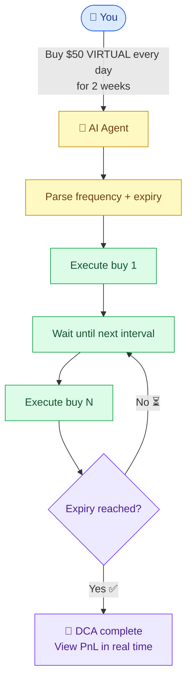
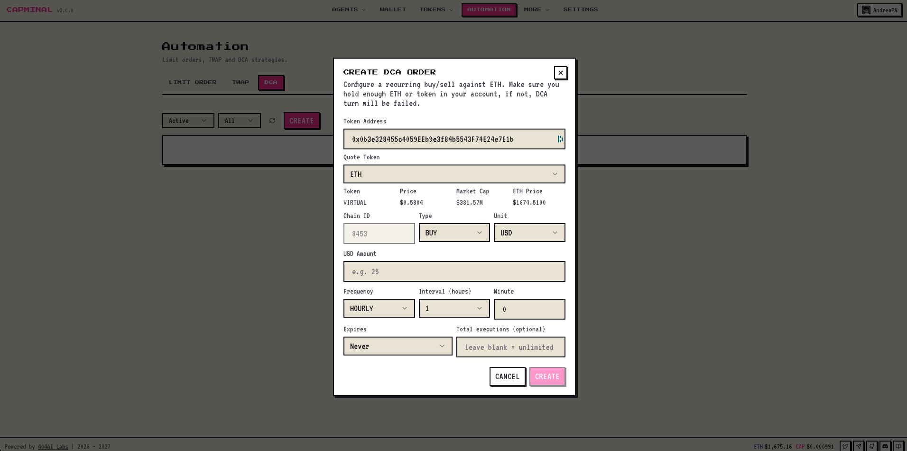

# DCA


**DCA** (Dollar-Cost Averaging) lets you automatically buy a token at regular intervals — no timing, no emotion, no FOMO. Set your frequency and expiry, and the AI executes for you.


## TWAP vs DCA — what's the difference?

TWAP and DCA both automate your trades, but they solve different problems. (Not sure what [TWAP](twap.md) is? Read the dedicated article first.)

|                       | TWAP                                                         | DCA                                                          |
| --------------------- | ------------------------------------------------------------ | ------------------------------------------------------------ |
| **Goal**              | Split one large order into smaller chunks to reduce price impact | Accumulate a position over time by buying regularly          |
| **Best for**          | Selling or buying a big bag _right now_ without slipping     | Building a position _gradually_ over days, weeks, or months  |
| **Time window**       | Short — minutes to days                                      | Long — days to months                                        |
| **Trigger**           | Time-based intervals until the full order is filled          | Frequency-based until the expiry date                        |
| **Price protection**  | Per-chunk slippage check                                     | Not needed (each buy is small)                               |

In short: **TWAP helps you exit or enter a large position without moving the market. DCA helps you build a position steadily over time.**

## How DCA works

Set just two parameters and let the AI take over:

| Config      | What it does                                                |
| ----------- | ----------------------------------------------------------- |
| **Frequency**  | How often to buy — e.g. every 6 hours, daily, every 3 days |
| **Expires**    | When the DCA stops — e.g. in 2 weeks, on a specific date   |

Everything runs automatically from there. Your buy history and position PnL are tracked in real time, so all you need to do is chill and wait.

<figure><figcaption></figcaption></figure>

## Real-time PnL tracking

Once your DCA order is running, every buy is recorded. You can check your average entry price, total invested, and live PnL at any time — no spreadsheets needed.

## Get started

Set your frequency, pick an expiry, and let Capminal's AI do the rest. Whether you're DCAing into VIRTUAL, ETH, or any Base token, your position builds itself.

If you have ideas or feedback, feel free to share — we'd love to hear from you.