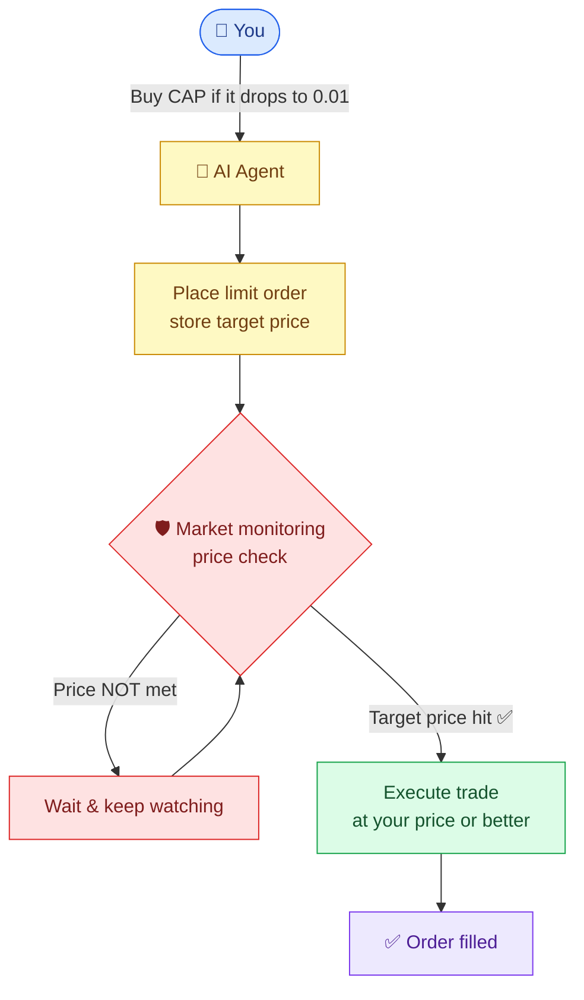
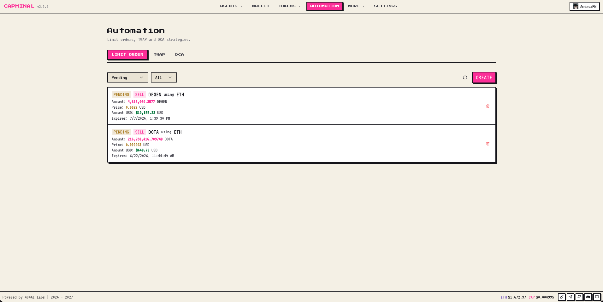
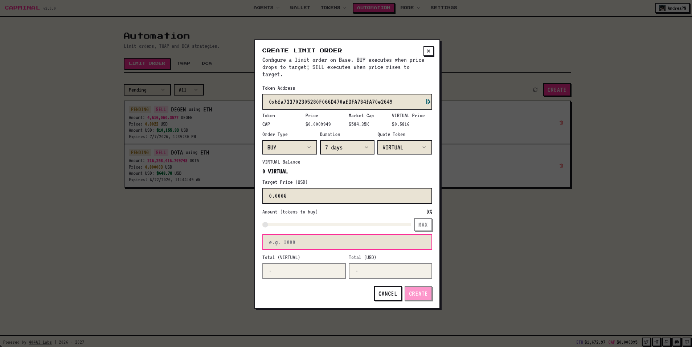

# Limit Orders


**Limit Orders** let you set the exact price you want to buy or sell a token — and Capminal's AI executes the trade automatically when the market hits your target. No more staring at charts.


## What is a limit order?

A limit order is a trade that only executes at your specified price or better. Unlike market orders (which fill immediately at the current price), limit orders give you **price control** — you decide the rate, and the order stays open until the market meets it.

Capminal makes this dead simple: just tell the AI agent what you want in plain language.

## What can you do with limit orders?

* **"Buy CAP if it drops to 0.01"**
* **"Sell VIRTUAL when it reaches 0.8"**
* **"Limit sell 50% of my CAP at 0.015"**

Set it once. The AI watches the market and executes when your conditions are met.

## How limit orders work

<figure><figcaption></figcaption></figure>

## Why use limit orders?

* **Never miss a price** — set your target and walk away
* **No emotions** — the AI executes dispassionately at your price
* **No screen time** — orders run 24/7 whether you're awake or not
* **Works with any Base token** — CAP, VIRTUAL, ETH, and more
* **Partial fills** — if the market only hits your price partially, the rest stays open

<figure><figcaption></figcaption></figure>

## Perfect for

* **Buying the dip** — set a buy order below market and let it fill when price drops
* **Taking profits** — set a sell order at your target and walk away
* **Entering positions** without overpaying
* **Exiting positions** at your ideal price, not the current one

Tell the AI your price. It handles the rest.