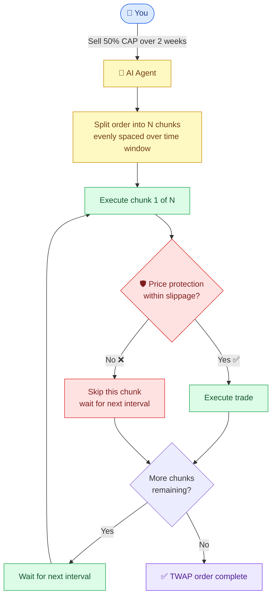

# TWAP


**TWAP** (Time-Weighted Average Price) is a pro trading strategy that splits your large order into smaller chunks, executed automatically over time — without moving the market against you.


## What is TWAP?

Ever wanted to buy or sell a big bag without slipping the price? TWAP is your answer. Instead of dumping a massive order all at once (and eating horrible price impact), Capminal's AI agent divides it into smaller, timed trades that blend into market activity.

The result? You get a price close to the average over your chosen window — no panic, no timing, no watching charts.

## What can you do with TWAP?

Tell the AI agent what you want in plain language:

* **"Sell 50% of my CAP over 2 weeks"**
* **"Buy $1000 VIRTUAL in 1 month"**
* **"Swap all my tokens to ETH in 3 days"**

Just type it. The AI handles the rest.

## How TWAP works

## Why use TWAP?

* **Reduce price impact** on large trades — no more moving the market against yourself
* **Get better average prices** over time — smooth out short-term volatility
* **Set it and forget it** — fully automated execution
* **Works with any Base token** — CAP, VIRTUAL, ETH, or any token on Base
* **Customizable intervals** — from 10 minutes to 1 day between chunks
* **Built-in price protection** — configurable allowable slippage per chunk

<figure><figcaption></figcaption></figure>

## Perfect for

* **Accumulating tokens** without FOMO buying the top
* **Exiting positions** without crashing the price
* **Long-term strategies** with a single command — no more manual repetitive trades

No more watching charts. No more panic selling. No more market timing.

Just type what you want. Let the AI execute.