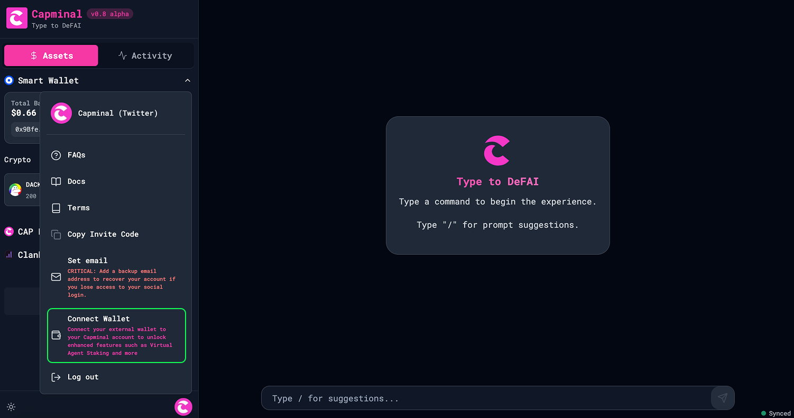
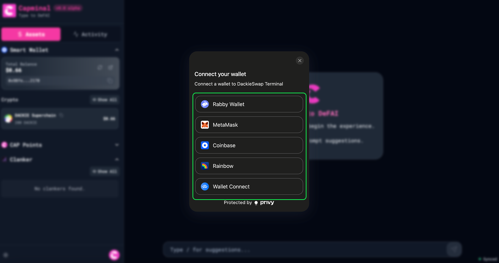
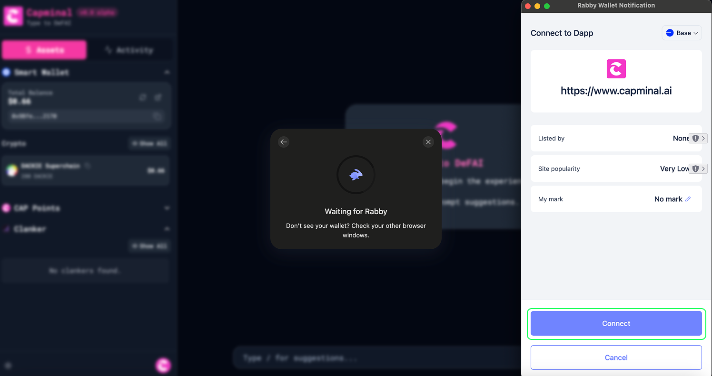
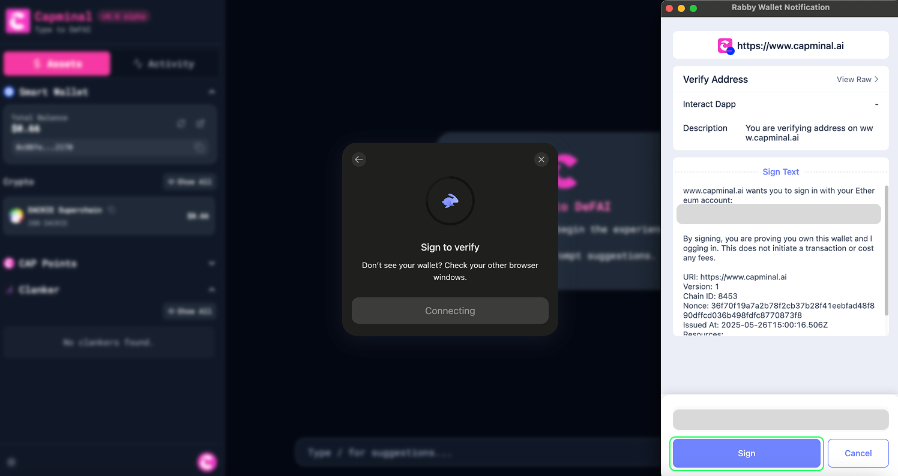
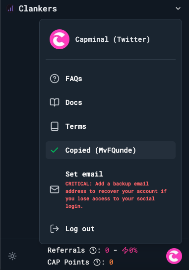

# CAP Points

Points systems are always a great way to attract more users—that’s why we developed CAP Points.

The rules for participating in CAP Points are simple and easy to understand, just based on referrals and volume.

## Swap

Swap Points is the points you earn by swapping on Capminal. The rules is as follows:

* 1 USD = 1 Swap Points.
* ETH/WETH is NOT calculated in Swap Points.


If you swap **CAP Tokens**, you will receive **25%** more swap points compared to swapping other tokens.


## Staking

Staking Points is the points you earn by staking CAP on [Virtuals Agent Staking](https://app.virtuals.io/stake-agent?id=23397). Capminal Wallet is a smart contract wallet linked to your social account, so to earn CAP Points by staking CAP on the Virtual side, you need to connect your external wallet to your Capminal account. You can find the connect option in the images below.

<figure><figcaption></figcaption></figure> <figure><figcaption></figcaption></figure>

<figure><figcaption></figcaption></figure> <figure><figcaption></figcaption></figure>

The rules is as follows:

* Stake 500 CAP = 1 Staking Points / day


If you unstake your position, you will stop receiving Staking Points, even though your CAP will remain in the 14-day unstaking period. Please keep this in mind.


## CAP Points


**CAP Points** will be used for **CAP** **airdrop** ( refer [Tokenomics](../../cap-token/tokenomics.md) ) and future campaigns.


CAP Points are calculated as follows:

* CAP Points = ( Swap Points + Staking Points ) \* ( 1 + Boost)


Example:

* Your Swap Points = 1000
* Your Staking Points = 1000
* Your Boosted = 20%

\=> Your CAP Points = (1000 + 1000) \* 120% = 2400


## Referrals and Boost

Referrals represent the number of users you have invited. This number is used to boost your CAP Points. The rules are as follows:

* Each referral has swap volume greater than 10 USD will be 1% boosted percentage.
* There are no limit for the number of referrals you can invite.
* The maximum boosted percentage is 20% except how many referrals you have.
* Your CAP Points will be updated back fill if your boosted percentage increase.

Start inviting your friends by getting your invite code, as shown below.

<figure><figcaption></figcaption></figure> <figure><figcaption></figcaption></figure>

##
