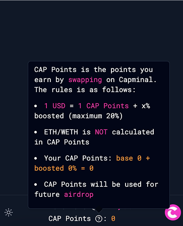
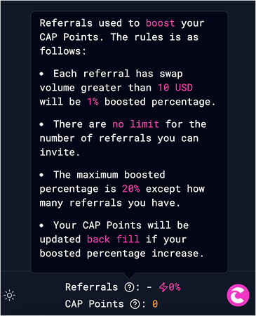

# CAP Points

Points systems are always a great way to attract more users—that’s why we developed CAP Points.

The rules for participating in CAP Points are simple and easy to understand, just based on referrals and volume.

## CAP Points


**CAP Points** will be used for **CAP** **airdrop**, refer [Tokenomics](../../cap-token/tokenomics.md) here!


CAP Points is the points you earn by swapping on Capminal. The rules is as follows:

* 1 USD = 1 CAP Points + x% boosted (maximum 20%)
* ETH/WETH is NOT calculated in CAP Points

The images below contain tooltips that provide detailed descriptions about Referrals and CAP Points.

<figure><figcaption></figcaption></figure> <figure><figcaption></figcaption></figure>

## Referrals

Referrals used to boost your CAP Points. The rules is as follows:

* Each referral has swap volume greater than 10 USD will be 1% boosted percentage.
* There are no limit for the number of referrals you can invite.
* The maximum boosted percentage is 20% except how many referrals you have.
* Your CAP Points will be updated back fill if your boosted percentage increase.

Start inviting your friends by getting your invite code, as shown below.

<figure><figcaption></figcaption></figure> <figure><figcaption></figcaption></figure>

##
