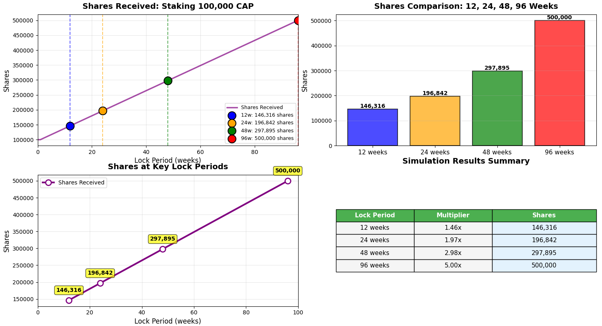

# CAP Staking

<figure><figcaption></figcaption></figure>

## What is CAP Staking?

CAP Staking is a token locking mechanism that rewards you with shares based on how long you commit to locking your tokens. When you stake your CAP tokens, you receive shares that are calculated using a multiplier system. The longer your lock period, the higher your multiplier, which means more shares for the same amount of tokens.

## Key Benefits

* **More Longer More Shares**: Lock your tokens longer to get a higher multiplier (up to 5x)
* **Simple Process**: Easy to stake and unstake your tokens
* **Earn CAP XP**: The first use case of CAP Staking is earning [CAP XP](cap-xp.md)


There will be more use cases when staking **CAP** besides earning CAP XP. T.B.U soon


## Getting Started

Before you begin staking, make sure you have:

* CAP tokens in your wallet
* Enough ETH to cover gas fees for transactions
* A clear understanding of how long you want to lock your tokens


Each Capminal account just can have 1 CAP staking position


#### Minimum Requirements

* **Minimum Lock Period**: 1 week
* **Maximum Lock Period**: 96 weeks
* **Minimum Stake Amount**: Any amount greater than zero

## Staking Your CAP Tokens

#### How to Stake

1. **Choose Your Amount**: Decide how many CAP tokens you want to stake
2. **Select Lock Period**: Choose how long you want to lock your tokens (1-96 weeks)
3. **Confirm Stake**: Submit your stake transaction

#### First-Time Staking

When you stake for the first time, you'll create a new staking position. You'll need to:

* Specify the amount of CAP tokens to stake
* Choose your lock period (1-96 weeks)
* Confirm the transaction

Your tokens will be locked until the unlock time, and you'll receive shares based on your chosen lock period.

#### Adding to Existing Stake

If you already have a staking position, you can add more tokens to it:

* **Same or Longer Lock Period**: If you add tokens with the same or longer lock period, your position will be updated with the new lock period and recalculated shares
* **Shorter Lock Period**: If you try to add tokens with a shorter lock period, your existing lock period will be maintained, and shares will be recalculated based on your total staked amount


You cannot shorten your lock period in any cases except waiting to unlock time.


## Lock Periods and Multipliers

<figure><figcaption></figcaption></figure>

#### Understanding Multipliers

Your multiplier determines how many shares you receive for each CAP token you stake. The multiplier scales linearly based on your lock period:

* **1 week lock** = 1x multiplier (100 shares per 100 tokens)
* **96 weeks lock** = 5x multiplier (500 shares per 100 tokens)

#### Multiplier Calculation

The multiplier increases linearly between 1 week and 96 weeks:

* Minimum: 1x (1 week)
* Maximum: 5x (96 weeks)
* The multiplier scales proportionally for any period between 1 and 96 weeks


Examples:

* Stake 100 CAP for 1 week: Receive 100 shares (1x multiplier)
* Stake 100 CAP for 48 weeks: Receive approximately 300 shares (3x multiplier)
* Stake 100 CAP for 96 weeks: Receive 500 shares (5x multiplier)


#### Choosing Your Lock Period

Consider these factors when choosing your lock period:

* **Long-term Commitment**: Longer locks give higher multipliers but less flexibility
* **Short-term Flexibility**: Shorter locks give lower multipliers but more flexibility


**Advice**: Align your lock period with your investment timeline


## Unstaking Your Tokens

#### When Can You Unstake?

You can unstake your tokens only after your lock period has expired. The unlock time is calculated from when you first staked (or when you last added to your stake with a longer lock period).

#### How to Unstake

1. **Check Your Unlock Time**: Verify that your lock period has expired
2. **Confirm Unstake**: Click Unstake and confirm


You cannot unstake before your lock period expires


## Frequently Asked Questions

#### How do I know what multiplier I'll get?

Your multiplier is calculated based on your lock period. The multiplier scales linearly from 1x (1 week) to 5x (96 weeks). You can check your multiplier at any time using the view functions.

#### Can I change my lock period after staking?

You can effectively extend your lock period by adding more tokens with a longer lock period. However, you cannot reduce your lock period once set. If you add tokens with a shorter lock period, your original lock period will be maintained.

#### What happens if I want to unstake before my lock period ends?

You cannot unstake your tokens before your lock period expires. Make sure you're comfortable with your chosen lock period before staking.

#### Can I stake multiple times?

Yes, you can add more tokens to your existing stake at any time. Your position will be updated with the new total amount and shares will be recalculated.

#### Can I see my stake information on a Basescan?

Yes, you can view all your staking information on Basescan by checking the contract's view functions with your wallet address.

## Conclusion

CAP Staking offers a simple and rewarding way to earn shares by locking your CAP tokens. By understanding how lock periods, multipliers, and shares work, you can make informed decisions about your staking strategy. Remember to choose a lock period that aligns with your goals and always verify your stake information before making decisions.

Happy staking!
