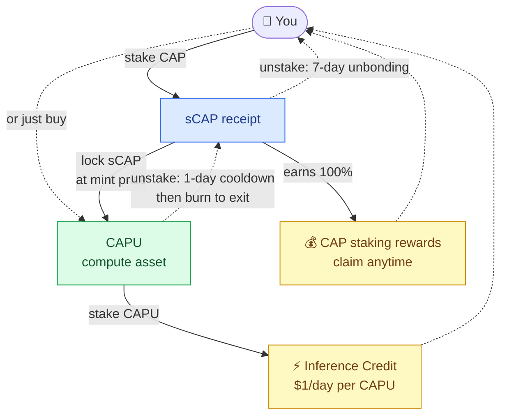
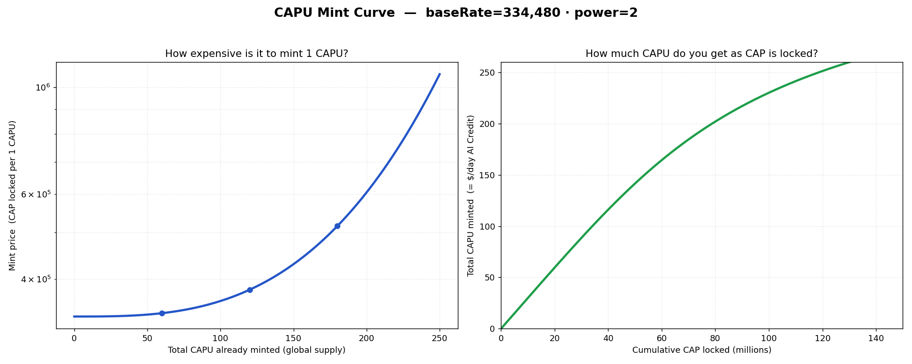
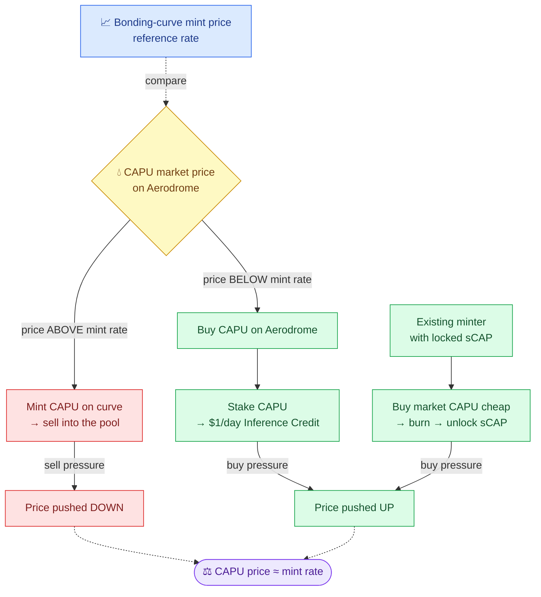

# Mint CAPU


**CAPU** is the compute asset of the Capminal. Holding **staked CAPU** gives you a daily allowance of Inference Credit on the [OpenCAP Gateway](../opencap/gateway.md), **$1 of inference usage per CAPU, every day,** without ever selling your CAP.



**Heritage.** The CAP / sCAP / CAPU model is **forked from Venice.ai's VVV / sVVV / DIEM** staking design — a proven two-token "stake capital, mint compute" system — and hardened for Capminal's own economics.


## The big idea in one minute

There are three things to know about:

| Asset    | What it is                        | What it does for you                              |
| -------- | --------------------------------- | ------------------------------------------------- |
| **CAP**  | The token you already hold        | Your capital. You lock it, you never lose it.     |
| **sCAP** | A receipt you get for locking CAP | Proves your CAP is parked, and earns CAP rewards. |
| **CAPU** | The compute asset                 | Stake it to get **$1/day of Inference Credit** each.     |

The key promise: **your capital (CAP) and your compute (CAPU) are completely separated.** You lock CAP → you mint CAPU → you spend Inference Credit. Whenever you want your CAP back, you burn the CAPU and unlock the _exact_ CAP you started with. Minting compute never costs you principal.

#### The whole system at a glance



Solid arrows = the way in (stake → mint → use). Dotted arrows = the way out (unstake → burn → get your CAP back) and the rewards flowing to you. The exit has waiting periods — **1 day** to unstake CAPU and **7 days** to unstake sCAP (see Section 4). Notice a CAP holder ends up with **both** yellow boxes at once: CAP rewards **and** Inference Credit.

<figure><figcaption></figcaption></figure>

***

## Inference Credit: what you actually get

When you **stake CAPU**, the OpenCAP Gateway watches your wallet and grants you Inference Credit:

* **$1 of inference usage per day, per staked CAPU.** Stake 50 CAPU → $50/day of inference.
* Credit **resets every day at 00:00 UTC.** It does **not** roll over — unused credit today is gone tomorrow. Think of it as a daily allowance, not a balance.
* Credit is tied to your **staked** CAPU. CAPU sitting in your wallet (unstaked) earns nothing.

Our users can estimate how many CAP staked → how many Inference Credit per day in the UI.

<figure><figcaption></figcaption></figure>

***

## CAP staking rewards: the second income stream

Inference Credit is only **half** of what a CAP holder earns. The moment you stake CAP, you also start earning **more CAP** as a staking reward — on top of any Inference Credit.

So if you take the CAP-holder path, you collect **two rewards at the same time:**

| Reward                | Where it comes from              | Form                              |
| --------------------- | -------------------------------- | --------------------------------- |
| **CAP staking yield** | Streamed rewards for staking CAP | More **CAP** tokens you can claim |
| **Inference Credit**         | Staking the CAPU you minted      | **$1/day** of inference usage per CAPU   |

How the CAP yield works, in plain terms:

* Rewards **stream continuously** to everyone who holds sCAP (your CAP-staking receipt). The longer you stay staked, the more CAP you accrue.
* You receive **100% of your share — there is no protocol fee.** You earn the full amount whether your sCAP is sitting idle or locked to mint CAPU.
* Your rewards just keep adding up. You can **claim** your earned CAP to your wallet whenever you like.
* Rewards are topped up by the treasury in batches and spread out smoothly over time, so the rate can rise or ease depending on how much is being distributed.

> **The key point:** staking CAP earns CAP yield **and** funds your Inference Credit at once. Locking your sCAP to mint CAPU does **not** turn off your CAP rewards — you keep both.

***

## How to get CAPU

There are two paths. Pick whichever fits you.

### Path A — The fast way: just buy it

If you only want Inference Credit and don't care about staking, **buy CAPU on the market**, then stake it.

```
Buy CAPU  →  Stake CAPU  →  Get $1/day per CAPU
```

That's it. You never touch CAP or sCAP. This is the recommended path for most users.

### Path B — The CAP-holder way: lock and mint

If you hold CAP and want to earn yield **and** get compute, you mint CAPU yourself:

```
1. Stake CAP        →  receive sCAP (1:1 receipt)          you now earn CAP rewards
2. Lock sCAP        →  mint CAPU                            at the current mint price
3. Stake CAPU       →  get $1/day per CAPU of Inference Credit
```

To get your CAP back later:

```
4. Unstake CAPU     →  wait 1-day cooldown
5. Burn CAPU        →  unlock your sCAP (your original ratio, protected)
6. Unstake sCAP     →  wait 7-day unbonding  →  receive your CAP
```

<figure><figcaption></figcaption></figure>

### Waiting periods (how long exits take)

Exits are not instant — each side has a built-in waiting period to keep the system stable. These are the **current live settings on Base mainnet:**

| Step                                                       | Waiting period       | What you do                                         |
| ---------------------------------------------------------- | -------------------- | --------------------------------------------------- |
| **Unstake CAPU** (to stop Inference Credit / free it for burning) | **1 day** cooldown   | `initiateUnstake` → wait 1 day → `unstake`          |
| **Unstake sCAP** (to get your CAP back)                    | **7 days** unbonding | `initiateUnstake` → wait 7 days → `finalizeUnstake` |

So a full exit from compute back to CAP takes about **1 day + 7 days ≈ 8 days** end to end. Plan ahead if you'll need your CAP liquid. _(Buying/selling CAPU on the market has no waiting period — only on-chain unstaking does.)_**Two more things worth remembering:**


* While CAP is staked as sCAP, you keep earning **100% of CAP staking rewards** — locked or not.&#x20;
* When you burn CAPU to exit, you get back CAP based on **your original lock ratio**, _not_ today's mint price. Early minters are protected — a later price change can never shrink the CAP you're owed.


***

## The mint price: why it goes up

This section matters only for **Path B** (minting your own CAPU). If you just buy CAPU, you can skip it.

CAPU is minted on a **bonding curve**: the more CAPU already exists, the more CAP it costs to mint the next one. This keeps compute supply healthy and rewards early participants.

```
mint price  =  baseRate × e^( power × (current supply ÷ scale)³ )
CAPU minted  =  CAP locked ÷ mint price
```

You don't need the math. Here's what it means in practice with the **current live settings**:

| Setting    |      Live value | Meaning                                     |
| ---------- | --------------: | ------------------------------------------- |
| `baseRate` | **334,480 CAP** | Cost to mint 1 CAPU when supply is at zero   |
| `power`    |           **2** | How sharply the price curves up             |

> `scale` is a fixed internal curve constant that sets how quickly the price steepens.

<figure><figcaption></figcaption></figure>

#### The curve

* **Left chart** — how many CAP it costs to mint **one** CAPU as more CAPU enters circulation.
* **Right chart** — how much total CAPU exists as more CAP gets locked.

#### Reading the curve in numbers

| Total CAPU minted | Mint price (CAP per CAPU) | vs. base | Plain meaning           |
| ----------------- | ------------------------: | -------: | ----------------------- |
| 0 (empty)         |                   334,480 |    1.00× | Cheapest possible mint  |
| 60 CAPU           |                   339,874 |    1.02× | Still basically flat    |
| 120 CAPU          |                   380,149 |    1.14× | Starting to rise        |
| 180 CAPU          |                   515,218 |    1.54× | Now noticeably pricier  |
| 250 CAPU          |                 1,064,140 |    3.18× | Climbing steeply        |

#### **Takeaways for a minter:**

* Early on, price moves **slowly** — early minters get the best rate.
* As supply grows, the price **accelerates** — each new CAPU costs more than the last.
* Eventually the curve becomes a **hard ceiling** — the protocol will refuse mints that push the exponent too high. This caps total compute supply by design.

> 💡 The exact CAP-to-dollar cost depends on the live CAP price, so these are CAP amounts, not fixed USD prices.

***

## Arbitrage: how the market keeps CAPU in line

CAPU isn't only **mintable** — it's also **tradable**. CAPU is seeded into **two liquidity pools on Aerodrome — CAPU/CAP and CAPU/WETH** — so anyone can **buy CAPU directly** and stake it for Inference Credit, instead of going the long way round (**buy CAP → stake to sCAP → mint CAPU**).

That means the same staked CAPU can be obtained two ways:

* **Mint it** along the bonding curve (Path B), or
* **Buy it** on Aerodrome (Path A).

Whenever an asset has two prices, arbitrage pulls them together. The bonding-curve **mint price** acts as the reference rate, and the **market price** floats around it:

* **If CAPU trades _above_ the mint rate** (market price > mint price), minting is cheaper than buying. A user can **mint fresh CAPU on the curve and sell it into the pool**, capturing the spread. That sell pressure pushes the market price back **down** toward the mint rate.
* **If CAPU trades _below_ the mint rate** (market price < mint price), buying is cheaper than minting. A user has two profitable moves, both of which add buy pressure and push the price back **up**:
  * **Buy CAPU and stake it** — get the same **$1/day** of Inference Credit for less than it would cost to mint.
  * **Existing minters close their position cheaply** — anyone who previously minted CAPU (and locked sCAP as collateral) can buy CAPU on the market at below-mint-price, burn it, and unlock their original sCAP for less than the original mint cost. Their buying adds upward pressure on CAPU price. _(Note: this path requires a prior minting position — pure market buyers cannot burn CAPU to unlock CAP, as the contract tracks each user's own minted balance.)_

So rational users naturally close any gap, and the CAPU market price tracks the bonding-curve mint rate — while everyone still keeps a fast, no-cooldown way to get in and out by simply buying or selling on Aerodrome.



***

## Common questions

Do I lose my CAP when I mint CAPU?&#x20;

→ No. CAP is _locked_, not spent. Burn your CAPU and you unlock the same CAP back.

Does unused Inference Credit carry over?&#x20;

→ No. It resets at 00:00 UTC daily. Stake the amount of CAPU that matches your real daily inference usage.

What if I just want inference access and don't hold CAP?&#x20;

→ Use Path A — buy CAPU on the market and stake it. Done.

How long does it take to get my CAP back?&#x20;

→ About 8 days end to end: a 1-day cooldown to unstake CAPU, then a 7-day unbonding period to unstake sCAP into CAP. Buying or selling CAPU on the market is instant — only on-chain unstaking has a wait.

Is there a fee on staking rewards?&#x20;

→ No. Stakers receive 100% of CAP rewards.

***

## Contracts & Addresses

Everything runs on **Base mainnet** (chain ID `8453`). All contracts are public and verifiable on Basescan.

<table><thead><tr><th width="200.95135498046875">Contract</th><th>What it is</th><th>Address</th></tr></thead><tbody><tr><td><strong>CAP</strong></td><td>The capital token you stake</td><td><a href="https://basescan.org/token/0xbfa733702305280F066D470afDFA784fA70e2649"><code>0xbfa7…2649</code></a></td></tr><tr><td><strong>CAPU</strong></td><td>The compute token (stake for Inference Credit)</td><td><a href="https://basescan.org/token/0x67558d3D990EA40b64fD37FBd5c4860d1f9B3a9F"><code>0x6755…3a9F</code></a></td></tr><tr><td><strong>sCAP / ScapStaking</strong></td><td>Staking vault + sCAP receipt + CAPU mint</td><td><a href="https://basescan.org/address/0x92ee42A61CF55642949B4fE74bB4796978ddB47a"><code>0x92ee…B47a</code></a></td></tr></tbody></table>


sCAP is a **non-transferable** receipt minted by the ScapStaking contract — it lives at the same address and only moves when you stake or unstake.


## Quick reference

| You want to…                   | Do this                                               |
| ------------------------------ | ----------------------------------------------------- |
| Just get Inference Credit             | Buy CAPU → Stake CAPU                                 |
| Earn yield **and** get compute | Stake CAP → Lock sCAP → Mint CAPU → Stake CAPU        |
| Get your CAP back              | Unstake & Burn CAPU → Unstake sCAP → receive CAP      |
| Earn CAP rewards               | Stake CAP (you earn while it's staked, locked or not) |

***

_Inference Credit is $1/CAPU/day on the OpenCAP Gateway, renewed daily at 00:00 UTC and non-accumulating. Mint-price settings shown are the current on-chain values and may be recalibrated; recalibration never affects already-minted CAPU or your CAP exit ratio._
