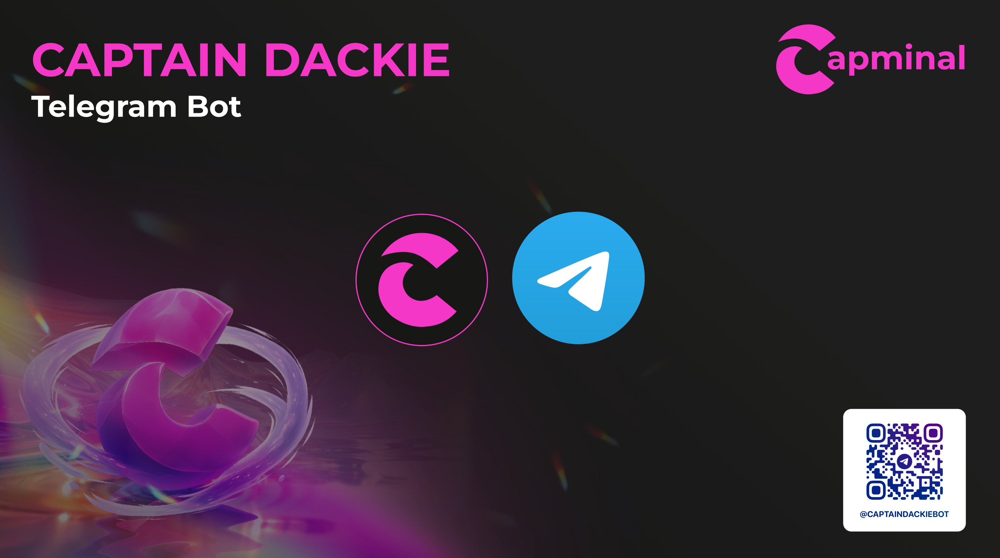

# Telegram Bot


Note that trading on Telegram bot also receive [CAP Points](cap-points.md).


## Introduction

Captain Dackie Telegram Bot is live here [https://t.me/captaindackiebot](https://t.me/captaindackiebot)&#x20;

<figure><figcaption></figcaption></figure>

You need to link your Telegram account with Capminal account before use.

<figure><figcaption></figcaption></figure>

## How to use

### 1. Let's start

Access Captain Dackie Telegram bot, if it's the first time, you can click "Start".

<figure><figcaption></figcaption></figure>

### 2. Main Menu

After that, you will see the supported commands on menu.

<figure><figcaption></figcaption></figure>

### 3. Token Control Plate

To buy or sell a token, we can paste the address to the chat, and the control plate will be displayed with token info, then you can click the buttons to manipulate. Let's go one by one:

1. It's a button to switch between Buy group and Sell group.
2. Share PnL: if you have position before, here is button to share your PnL, you can also manage your PnL in [Capminal UI](https://capminal.ai/).
3. Slippage: you can config your global slippage here, this slippage will affect for all client of Capminal includes Capminal Gems, Capminal Agent, Captain Dackie on X.
4. 4 & 5 are button to withdraw your token to other wallet. In general, if you use other clients you must prompt on Agent or instruct Captain Dackie move your tokens or ETH. But for telebot, we want to create the familiar behavior, so you can withdraw your tokens by button.

<figure><figcaption></figcaption></figure>

<figure><figcaption></figcaption></figure>

### 4. Wallet Menu

In walet menu, you can retrieve your invite link, your Capminal Wallet Address, and can withdraw your ETH also.

<figure><figcaption></figcaption></figure>

### 5. Help menu

This menu show the commands you can run on Captain Dackie Telebot and their purpose, command will be updated in the future.
